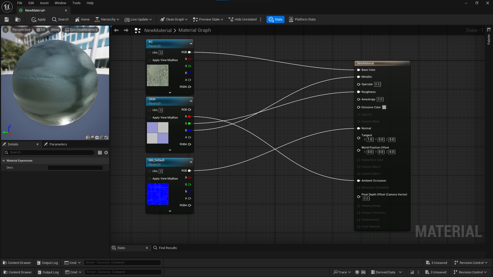
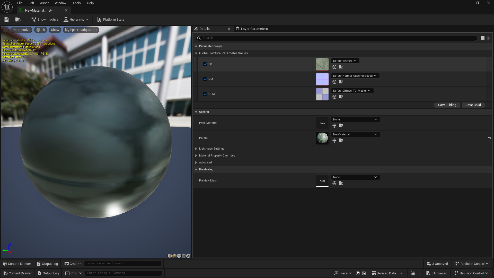
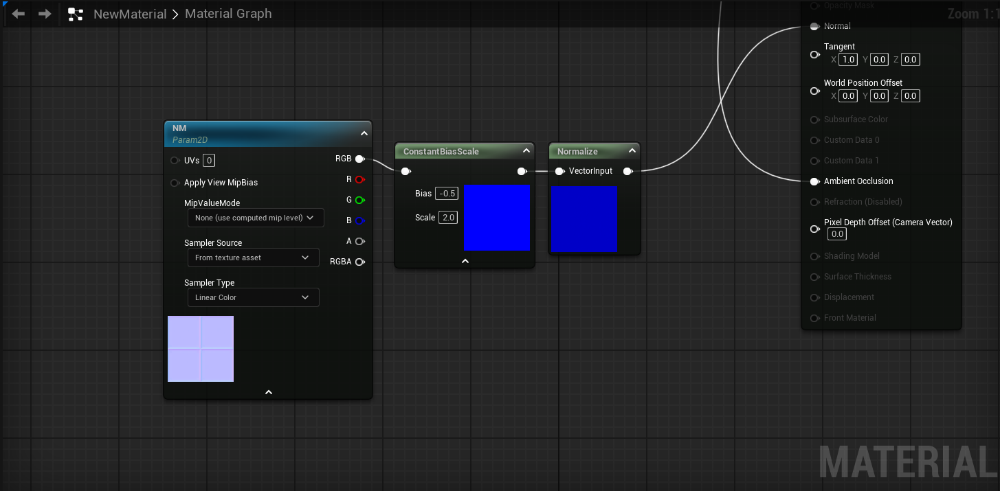
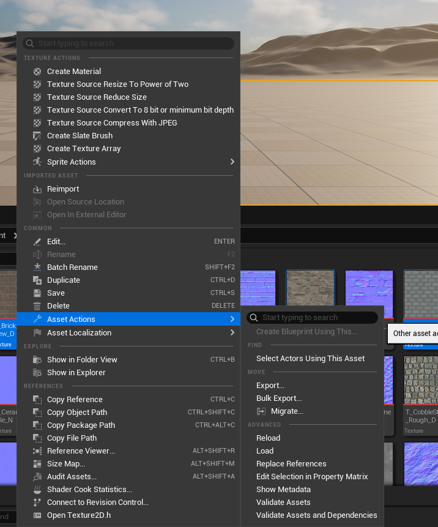

= Materials & Textures

Materials control how something is rendered in Unreal Engine. While they are commonly used to define the appearance of meshes and how their surfaces respond to lighting, they are not limited to mesh materials.

Depending on the material domain and settings, materials can also be used for:

* Mesh and surface materials
* Decals
* User interface elements
* Post-processing effects

With the custom editor, you can create new materials and textures for use in PAYDAY 3 as long as the assets and features used by the material can be successfully cooked for the game.

This page focuses primarily on creating a basic surface material and material instance, but the same Material Editor is also used when creating materials for decals, UI, and post processing.


== Before You Start

It is recommended to avoid touching pre-existing cooked materials that were from PAYDAY 3 originally due to their editor data being stripped, so you won't get much use out of them. It is better to create your own master materials from scratch. 

If you are also planning on distributing materials you have created, it is advised to NOT use Static Switch Parameter nodes, they can cause issues or crash users who are attempting to use them without the custom editor. 

== Creating a Master Material

To create a master material, go to the area of the Content Browser where you want to create it, right-click, and select *Material* under the Create Basic Asset section.

For this guide, name it `MM_YourMatName`. We will be working with both master materials and material instances, so using prefixes such as `MM_` and `MI_` helps keep them organized.

When the material opens, the available inputs depend on its current settings and Material Domain. A normal Surface material can expose inputs such as Base Color, Metallic, Specular, Roughness, Normal, and Ambient Occlusion.

The material settings are also where you configure properties such as Blend Mode, Two Sided rendering, and Material Domain.

For example, changing the Material Domain allows the same material system to be used for other purposes such as *Deferred Decal*, *User Interface*, or *Post Process*. The node graph and available outputs will change to match the selected domain.

This guide uses the default *Surface* domain and builds a simple Base Color/ORM/Normal material.

I won't go into specifics on how to create a material that will suit your needs, since there are already plenty of tutorials out there, so I will be sticking with a basic Base Color/ORM/Normal Map formatted material for this.

If you would like official documentation of how to create materials, or get more in-depth explanations:

Official Epic Games Unreal Engine Documentation: https://dev.epicgames.com/documentation/unreal-engine/unreal-engine-5-5-documentation?application_version=5.5&lang=en-US

== Adding Nodes

To add your own new node, right click anywhere on the grid and a popup of nodes will appear. You can use the search bar to find nodes that you need, and there are also a few hotkeys that you could use.


To start off with our basic Base Color, search for a TextureSampleParameter2D and connect the RGB pin to Base Color, this will allow for you to change the texture in a material instance, which will be brought up later. You can name the Parameter to anything you like, "BC" or "Base Color" would fit.  


Now for the ORM texture, which is an abbreviation for Occlusion, Roughness, Metallic, this is a masking texture for which you can store 3 types of data in 1 texture, this type of texture is commonly found across many Unreal Engine games and is good practice for optimization and file size. 

Copy and paste your texture, rename the parameter to ORM, and use the "DefaultDiffuse_TC_Masks" texture. 

For this texture, the sampler type of this texture would need to be "Masks" for it to visually display correctly, not being able to do so would result in issues in displaying the texture. 

Take the R channel and put it in the Ambient Occlusion node

Take the G channel and put it in the Roughness node

Take the B channel and put it in the Metallic node

Lastly, for your normal map, you can paste another texture node and call this new texture parameter NM, and replace the texture being used with a normal map from the engine editor resources. Then take the RGB output and put it in the Normal Input

Your final result of the material should look like this if you have followed all steps properly. 




== Node Shortcuts

These are some of the shortcuts I use frequently, but there are plenty more. 

```
M + Left Click - Multiply Node

A + Left Click - Add Node

I + Left Click - If Node

S + Left Click - Scalar Parameter Node

O + Left Click - Invert (1-x) Node

1 + Left Click - Constant Node

C - Comment
```

== Creating a Material Instance

Once you are done tinkering with your Master Material, it is now time to create your Material Instance. A Material Instance is basically your original Master Material, but you are able to freely change scalars and paremeters/textures to what you want it to be. 

To create a Material Instance, right click on your Master Material and in the "Material Actions" tab, select "Create Material Instance". 

By default, Unreal Engine will call this Material Instance whatever your Master Material was, but ending in "_Inst"

If you want to rename it, name it "MI_YourMatInstName"

In the Material Instance screen, you can drag and drop your textures over the appropriate parameter, and save. 



== Importing Textures

There are plenty of different textures you can import, ranging from texture sheets to UI textures or stickers. 

Base Color textures should be imported with "BC7 (RGBA)" 

Masking textures, like an ORM texture for example, it is advised to set the compression to "BC7 (RGBA)" and unticking the "sRGB" box.

For normal maps, set compression to "NormalMap (BC5)" and unticking the "sRGB" box. 

[NOTE]
====
"NormalMap (BC5)" can cause channel artifacts, so if you instead want to use BC7 for better quality, set the texture's sampler type to Linear Color, plug the RGB node into a "ConstantBiasScale" make the Bias value -0.5, and your Scale value 2.0, then plug into a normalize node. 



If your Normal Map is also formatted in OpenGL (Y+) you can use the "Flip Green Channel" setting to convert it to a DirectX Normal Map. 
====

UI textures should be imported with "UserInterface2D (RGBA8)" And also in the **Mip Gen Details** change the setting "FromTextureGroup" to "NoMipMaps" it is generally not advisable to have texture streaming on your UI element texture as it could get lowered with texture quality, which you do not want. 

If you're porting a model or adding a collection of new textures you can select each texture, right click and hover over "Asset Actions" and in the second menu that appears, select "Edit Selection in Property Matrix" this can allow you to mass edit textures instead of needing to do it all one by one, which can be a huge time saver. 


